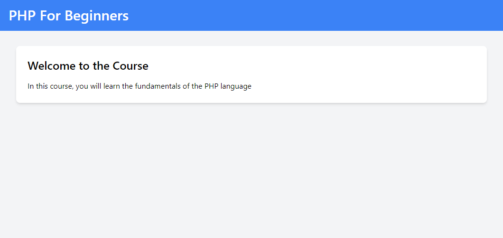

# PHP Tags, Printing & Comments

Alright, let's get started with our first bit of PHP code! We will start with the basics and then move on to more advanced topics. I realize that some of you may already know this stuff, but remember that this is a course for people that are new to PHP, so we have to start at the beginning.

## `.php` Files

PHP is a little different than most server-side languages in that, in that `.php` files can actually be loaded in the browser. PHP can be embedded with HTML. So, if we have a file called `index.php` and we load it in the browser, the PHP code will be executed and the HTML will be sent to the browser. This is one of the things that makes PHP so practical and easy to use.

In your text editor, open the `index.php` file in the `php-sandbox-starter/01-php-tags-printing-comments` folder. If you created your own project folder, just copy the starter HTML from that file into your file.

Access the page in the browser. If you are on MacOS, it will be something like `http://localhost:8000/php-sandbox`. If you are using Laragon, you can use the local domain, which would be something like `php-sandbox.test`.

You will see something like this:



<br>

The starting code is just some basic html with some Tailwind classes. Tailwind is a CSS framework. We will be using it to make our content look a little better.

```php
<!DOCTYPE html>
<html lang="en">
<head>
  <meta charset="UTF-8">
  <meta name="viewport" content="width=device-width, initial-scale=1.0">
  <script src="https://cdn.tailwindcss.com"></script>
  <title>Learn PHP From Scratch</title>
</head>
<body class="bg-gray-100">
    <header class="bg-blue-500 text-white p-4">
        <div class="container mx-auto">
            <h1 class="text-3xl font-semibold">Learn PHP From Scratch</h1>
        </div>
    </header>
    <div class="container mx-auto p-4 mt-4">
        <div class="bg-white rounded-lg shadow-md p-6">
           <!-- Content -->
            <h2 class="text-2xl font-semibold mb-4">Welcome to the Course</h2>
            <p>In this course, you will learn the fundamentals of the PHP language</p>
        </div>
    </div>
</body>
</html>
```

## Adding PHP

Typically if you are going to have HTML output along with PHP, you will put your php code at the top and then if you need to embed PHP within the HTML body, you can do that as well. Let's put some php at the top of our file.

```php
<?php
  echo 'Hello From PHP';
?>
```

You should now see the text above the layout. It is the very first thing that outputs. This is because the PHP code is executed first and then the HTML is sent to the browser. So, if we put the PHP code at the top, it will be the first thing on the page.

## PHP Tags

PHP code is wrapped in `<?php` and `?>` tags. This is how the server knows that it is PHP code. You can also use `<?` and `?>` but this is not recommended because it is not supported on all servers. So, it's best to just use the full tags. If I were to get rid of the tags, you would see the actual PHP code in the browser. The tags is what tells the server to execute the code and not send it to the browser.

The ending tag is actually not needed if you are at the end of the file. Temporarily remove the HTML and the ending tag and you will see that it still works. This is because the server knows that the PHP code is done when it reaches the end of the file.

```php
<?php
  echo 'Hello From PHP';
```

Put the HTML and ending tag back.

## Shorthand Tags

You can also use shorthand tags. This is where you just use the question mark and the greater than sign. This is not recommended though because it is not supported on all servers. So, it's best to just use the full tags.

## Printing

The `echo` statement is how we output data. It actually is not a function, but it is a language construct. That's why we are not using parenthesis like a function. Although, it will still work with parenthesis.

There are other ways to do this, but `echo` is the most common. We can also use `print` which is very similar.

```php
<?php
  echo 'Hello From PHP';
  print 'Hello using print';
?>
```

We are using quotes here because these are `strings`, which is a data type for a string of characters. We will talk more about data types soon. We can also echo out other data types such as integers and floats.

```php
<?php
  echo 5;
  echo 5.7;
?>
```

When we use echo with these types, they are converted to a string representation.

All lines in PHP must end with a semicolon. If you leave it off, you will get an error.

One big difference is that `echo` can take multiple parameters and `print` can only take one. For instance, this works with `echo` but not with `print`.

```php
<?php
  echo 'Brad', 'John';
?>
```

The reason that we are using quotes is because we are printing out a specific data type called a `string`. I will get more into data types soon.

There are other helpful functions to print out stuff when we are debugging, such as `var_dump` and `print_r`. We will get into those very soon after we talk about variables and data types.

## Comments

Comments are used to explain what the code is doing. They are also used toThey are not executed by the server. There are two types of comments in PHP. Single line comments and multi-line comments.

Single line comments start with two forward slashes.

```php
<?php
  // This is a single line comment
  echo 'Hello From PHP';
?>
```

In VS Code and most editors, you can use `ctrl` + `/` to comment out a line or a block of code.

Multi-line comments start with a forward slash and an asterisk and end with an asterisk and a forward slash.

```php
<?php
  /*
    This is a multi-line comment
    This is line 2
    This is line 3
  */
  echo 'Hello From PHP';
?>
```

## Outputting PHP within HTML

Instead of outputting our PHP at the top, let's move it into the content. I will leave the comments at the top for reference.

```php
<?php
   /*
    This is a multi-line comment
    This is line 2
    This is line 3
  */
?>
<!DOCTYPE html>
<html lang="en">
<head>
  <meta charset="UTF-8">
  <meta name="viewport" content="width=device-width, initial-scale=1.0">
  <script src="https://cdn.tailwindcss.com"></script>
  <title><?php echo 'Learn PHP From Scratch'; ?></title>
</head>
<body class="bg-gray-100">
    <header class="bg-blue-500 text-white p-4">
        <div class="container mx-auto">
            <h1 class="text-3xl font-semibold"><?= 'Learn PHP From Scratch'; ?></h1>
        </div>
    </header>
    <div class="container mx-auto p-4 mt-4">
        <div class="bg-white rounded-lg shadow-md p-6">
            <h2 class="text-2xl font-semibold mb-4"><?= 'Welcome to the course'; ?></h2>
            <?php echo '<p>In this course, you will learn the fundamentals of the PHP language</p>'; ?>
        </div>
    </div>
</body>
</html>
```

Notice that with the paragraph tag, I included the `<p>` tags in the echo statement. You can do this or you can just echo out the text and include the tags in the HTML.

This is not very typical. Usually, you would have your content in a variable and then echo out the variable. We will get into variables next.
