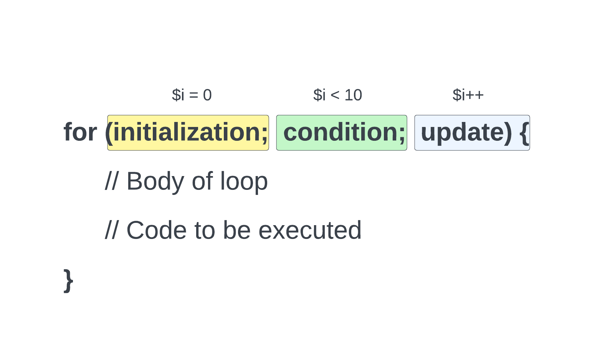
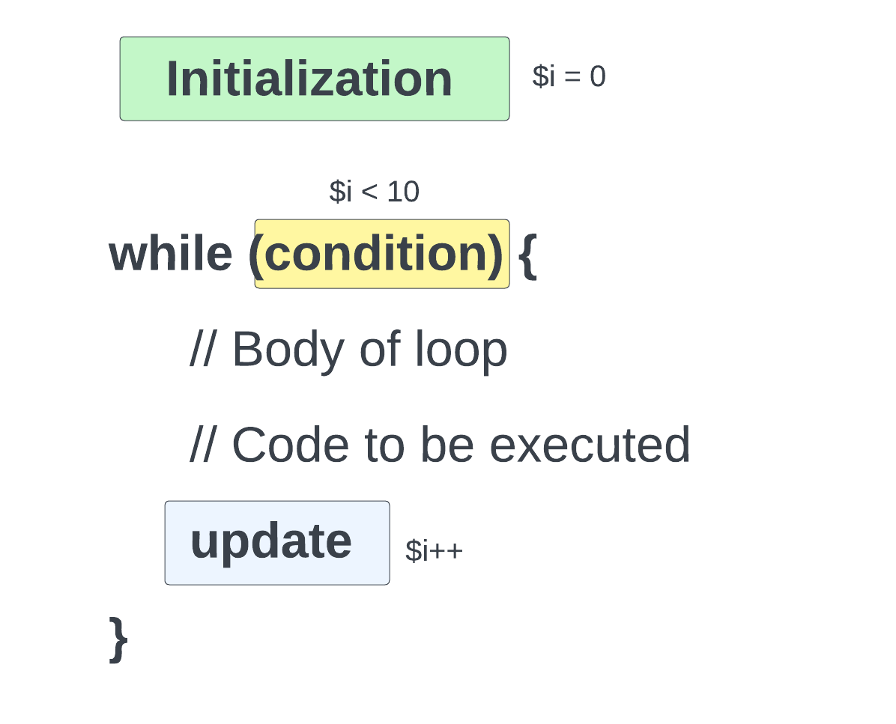
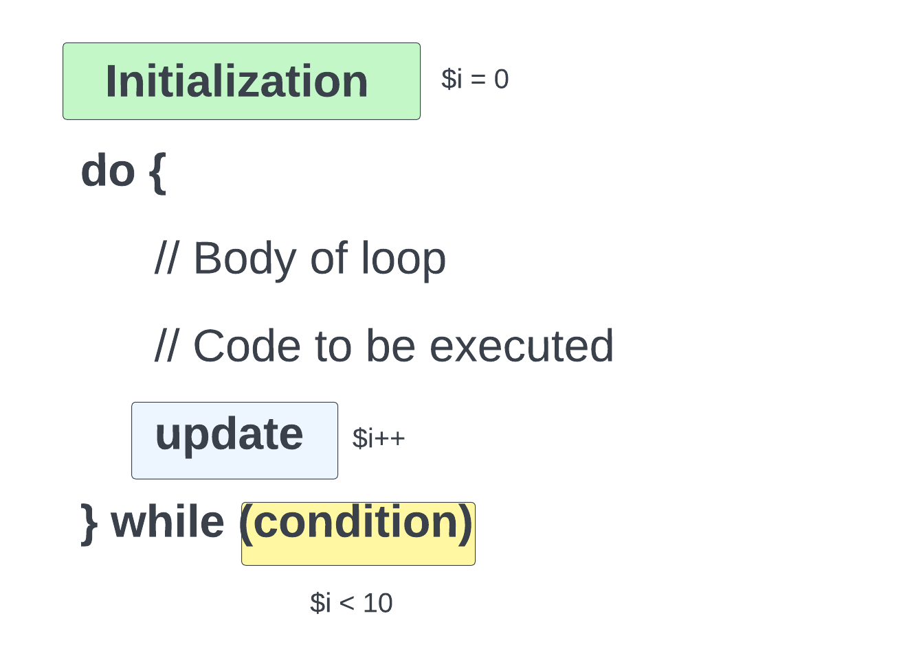

# Basic Loops

Now we are going to start to get into loops and iteration. Loops are used to repeat a block of code a certain number of times. This is useful when you want to do something a certain number of times, or when you want to do something for each item in an array.

The reason that I want to jump into this now is because we just looked at arrays, and arrays are a great use case for loops. We can use loops to iterate over each item in an array and do something with it.

We will get into looping over arrays soon, but I just want to show you some basic loops first.

## The `for` Loop

The `for` loop is traditionally the most common type of loop. It is used to repeat a block of code a certain number of times. Let's look at an image to help explain how it works:


<br>

It takes three parameters

- **Initialization**: This is where you set the starting value of the loop.
- **Condition**: This is where you set the condition that must be met for the loop to continue.
- **Update Expression/Increment**: This is where you set how to update the loop variable each time the loop runs. In many cases you increment the loop variable by 1 each time the loop runs, so it is also called the increment or increment expression.

Let's create a very simple loop that will run 10 times and display the value of the loop variable each time.

```php
for ($i = 0; $i < 10; $i++) {
    echo $i; // 0123456789
}
```

We start by setting the loop variable to 0. Then we set the condition to run the loop as long as the loop variable is less than 10. Then we increment the loop variable by 1 each time the loop runs.

It only goes to 9 because the condition is that the loop variable must be less than 10. Once it gets to 10, the condition is no longer true, so the loop stops. We can change it to include 10 by changing the condition to less than or equal to 10.

```php
for ($i = 0; $i <= 10; $i++) {
    echo $i; // 012345678910
}
```

## Infinite Loops

It is possible to create an infinite loop. This is a loop that will run forever. This is usually caused by a mistake in the code. Let's look at an example:

```php
for ($i = 0; $i < 10; $i--) {
    echo $i;
}
```

This will run forever because the loop variable is being decremented each time the loop runs. It will never reach 10 because it is being decremented each time. It will just keep getting smaller and smaller.

## Outputting HTML in a Loop

Let's use our template and output a list item that will display `Number i` for each number :

```php
<ul>
    <?php for ($i = 0; $i <= 10; $i++) { ?>
        <li>Number <?php echo $i; ?></li>
    <?php } ?>
</ul>
```

#### Alternate Syntax

There is another syntax for this where we do not need to use curly braces. We can use the `:` and `endfor` syntax instead. This is a little cleaner and easier to read.

```php
<ul>
    <?php for ($i = 0; $i <= 10; $i++) : ?>
        <li>Number <?php echo $i; ?></li>
    <?php endfor; ?>
</ul>
```

This is the syntax we will use when putting PHP in our HTML templates.

## The `while` Loop

The `while` loop is another type of loop. It is used to repeat a block of code as long as a certain condition is true. It takes one parameter, the condition. The condition is where you set the condition that must be met for the loop to continue.

Let's look at the syntax:



<br>

Let's create a very simple loop that will run 10 times and display the value of the loop variable each time.

```php
$i = 0;

while ($i < 10) {
    echo $i; // 0123456789
    $i++;
}
```

This is similar except we do not set the loop variable in the loop. We set it before the loop. Then we set the condition to run the loop as long as the loop variable is less than 10. Then we increment the loop variable by 1 each time the loop runs.

We can put it in our template like this:

```php
<ul>
  <?php $i = 0; while ($i <= 10): ?>
    <li>Number: <?= $i ?></li>
    <?php $i++; endwhile; ?>
</ul>
```

## The `do...while` Loop

The `do...while` loop is another type of loop. It is used to repeat a block of code as long as a certain condition is true. It takes one parameter, the condition. The condition is where you set the condition that must be met for the loop to continue.



The big difference with this loop is that it will always run at least once. This is because the condition is checked at the end of the loop instead of the beginning.

Let's create a very simple loop that will run 10 times and display the value of the loop variable each time.

```php
$i = 0;

do {
    echo $i; // 0123456789
    $i++;
} while ($i < 10);
```

It looks a little messy in the template, but we can do it:

```php
<ul>
  <?php $i = 0; do { ?>
    <li>Number: <?= $i ?></li>
    <?php $i++; } while ($i <= 10); ?>
</ul>
```

So we can get the same exact result with all 3 loops. Which one you use depends on your situation and depends on you as the developer. The `for` loop is the most common of the 3.
