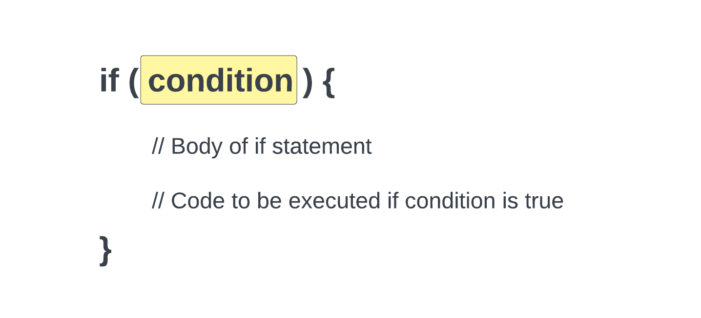
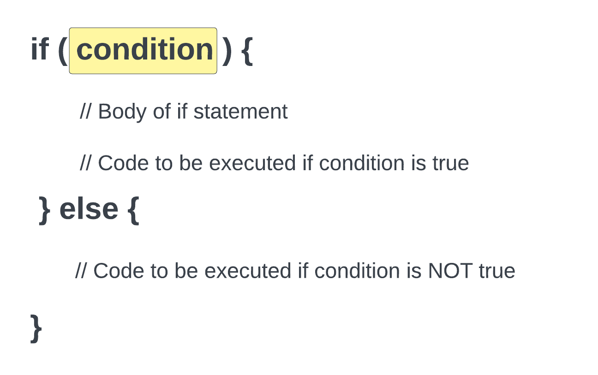

# If Statements

Now we are going to look at control structures. Control structures are used to control the flow of your program. In this lesson, we'll look at the following control structures:

- if statements
- if-else statements
- nested if statements
- if-elseif-else statements

We are just going to look at some simple examples here and just output to an empty page and then in the next lesson, we'll look at how to use these control structures in our template.

Here is the format of an `if` statement:


<br>

Let's look at an example:

```php
$age = 30;

if ($age >= 21) {
    echo 'You are old enough to drink in the US.';
}
```

In this example, we are checking to see if the variable `$age` is greater than or equal to 21. If it is, then we will echo out a message. If it is not, then nothing will happen. Let's look at another example. Since the age is 30, then the message will be echoed out. Go ahead and change it to 20 and see what happens...nothing.

## If-Else Statements

You may want something to happen if the condition is true and something else to happen if the condition is false. You can do this with an `if-else` statement. Here is the format of an `if-else` statement:


<br>

Let's look at an example:

```php
$age = 20;

if ($age >= 21) {
    echo 'You are old enough to drink in the US.';
} else {
    echo 'You are not old enough to drink in the US.';
}
```

In the above example, we are checking to see if the variable `$age` is greater than or equal to 21. If it is, then we will echo out a message. If it is not, then we will echo out a different message. If `$age` is set to 20, you will see the second message.

## Nested If Statements

You can nest `if` statements inside of other `if` statements. Here is an example:

```php
$age = 20;

if ($age >= 21) {
    echo 'You are old enough to drink in the US.';
} else {
    if ($age >= 18) {
        echo 'You are old enough to vote in the US.';
    } else {
        echo 'You are not old enough to drink or vote in the US.';
    }
}
```

In the above example, we are checking to see if the variable `$age` is greater than or equal to 21. If it is, then we will echo out a message. If it is not, then we will check to see if it is greater than or equal to 18. If it is, then we will echo out a different message. If it is not, then we will echo out a third message.

## If-Elseif-Else Statements

There is a cleaner way to write the above example. You can use an `if-elseif-else` statement. Here is the format of an `if-elseif-else` statement:


<br>

Let's use our example from above and rewrite it using an `if-elseif-else` statement:

```php
$age = 20;

if ($age >= 21) {
    echo 'You are old enough to drink in the US.';
} elseif ($age >= 18) {
    echo 'You are old enough to vote in the US.';
} else {
    echo 'You are not old enough to drink or vote in the US.';
}
```

In the above example, we are doing the same thing as the previous example, but we are using an `if-elseif-else` statement instead of a nested `if` statement.
