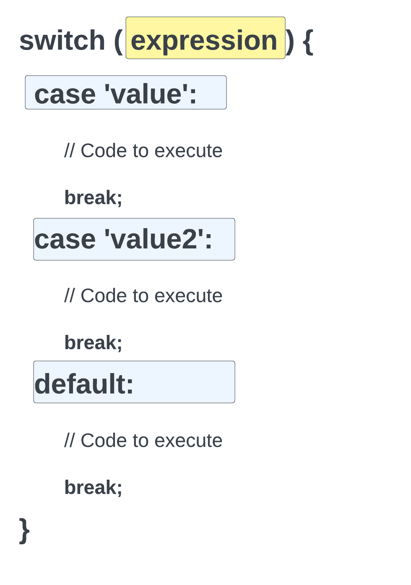

# Switch Statements

Switch statements are a way to execute different code based on different conditions or values. They are similar to if statements, but they are more concise and easier to read when there are many conditions to test. If you find yourself righting 5+ if statements in a row, you should consider using a switch statement instead.

Here is the format of a switch statement:



We test the value of an expression against different cases. If the value matches a case, the code in that case will be executed. If the value does not match any of the cases, the code in the default case will be executed.

Let's get the day of the week from the current date and use a switch statement to create a message and a color variable. Then we will create some HTML and use the color to style the background and display the message.

```php
<?php

$dayOfWeek = date('l');

switch($dayOfWeek) {
  case 'Monday':
    $message = 'Monday blues!';
    $color = 'blue';
    break;
  case 'Tuesday':
    $message = 'At least it\'s not Monday!';
    $color = 'green';
    break;
  case 'Wednesday':
    $message = 'Hump day!';
    $color = 'orange';
    break;
  case 'Thursday':
    $message = 'One more day until Friday!';
    $color = 'red';
    break;
  case 'Friday':
    $message = 'TGIF!';
    $color = 'purple';
    break;
  case 'Saturday':
    $message = 'Have a nice weekend!';
    $color = 'yellow';
    break;
  case 'Sunday':
    $message = 'Have a nice weekend!';
    $color = 'yellow';
    break;
  default:
    $message = 'Not a valid day.';
    break;
}
?>

<!DOCTYPE html>
<html lang="en">
<head>
  <meta charset="UTF-8">
  <meta name="viewport" content="width=device-width, initial-scale=1.0">
  <title>What Day Is It?</title>
  <link rel="preconnect" href="https://fonts.googleapis.com">
  <link rel="preconnect" href="https://fonts.gstatic.com" crossorigin>
  <link href="https://fonts.googleapis.com/css2?family=Roboto&display=swap" rel="stylesheet">
  <style>
    body {
      font-family: 'Roboto', sans-serif;
      background-color: <?php echo $color; ?>;
      color: white;
      display: flex;
      justify-content: center;
      align-items: center;
      height: 100vh;
    }
  </style>
</head>
<body>
  <h1><?= strtoupper($message) ?></h1>
</body>
</html>
```

As you can see, we can use PHP absolutely anywhere in our HTML. We can use it to create variables, create HTML, and even style our HTML.
