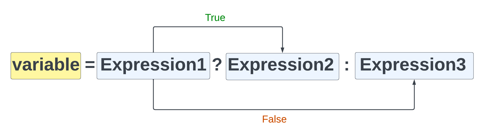

# Ternary Operator (? :)

The ternary operator is a shorthand way of writing an if...else statement and really comes in handy, especially when it comes to templates and HTML output.

Let's start by creating a simple if...else statement:

```php
<?php
    $score = 50;

    if ($score > 40) {
        echo 'high score!';
    } else {
        echo 'low score :(';
    }
?>
```

This is a simple if...else statement that checks if the score is greater than 40. If it is, it will echo out 'high score!', otherwise it will echo out 'low score :('.

Before we rewrite this using the ternary operator, let's take a look at the syntax:



So in this example, we are setting a variable with the result, but you can also just echo out the result directly.

So the ternary operator is made up of three parts:

1. The expression or condition to check
2. The value or expression to return if the condition is true
3. The value or expression to return if the condition is false

The easiest way to understand this is simply to understand that the `?` is the shorthand for if and the `:` is the shorthand for else.

Now let's rewrite the if statement using the ternary operator:

```php

<?php
    $score = 50;

    echo $score > 40 ? 'high score!' : 'low score :(';
?>
```

## Storing the Result

Like I said, you can also store the result of the ternary operator in a variable. Let's rewrite the above example to store the result in a variable:

```php
<?php
    $score = 50;

    $result = $score > 40 ? 'high score!' : 'low score :(';

    echo $result;
```

## Nested Ternary Operators

You can also nest ternary operators. Let's say we want to display a different message if the score is greater than 40 and the score is less than 60:

```php

<?php
    $score = 50;

    $result2 = $score > 40 ? ($score < 60 ? 'Average Score' : 'high score!') : 'low score :(';

    echo $result;
```

Multiple ternary operators can get confusing, so I would recommend using if...else statements if you have more than one condition to check. It's a shorthand solution, so it should be used for simple checks.

## Job Listings Example

Let's refactor some of our code from the job listings page to use the ternary operator.

### Alternating Row Color Refactor

In our job listings page, we are alternating the row color of the job listings. Let's refactor this to use the ternary operator.

Change the following code:

```php
 <div class="rounded-lg shadow-md
    <?php if ($index % 2 === 0): ?>
        bg-blue-100
    <?php else: ?>
        bg-white
    <?php endif; ?>">
```

to this:

```php
<div class="rounded-lg shadow-md <?php echo $index % 2 === 0 ? 'bg-blue-100' : 'bg-white'; ?>">
```

See how much better that looks?

### Remote/Local Badge Refactor

Let's take the code from our job listings page and use the ternary operator for the local location badge. Not only do I want to show the 'local' badge, but if it is not New York, I want to show the 'remote' badge.

This is the old code:

```php
<?php if ($job['location'] === 'New York') : ?>
    <span class="text-xs text-white bg-blue-500 rounded-full px-2 py-1 ml-2">Local</span>
<?php endif; ?>
```

Let's change it to use the ternary:

```php
 <?= $job['location'] === 'New York' ? '<span class="text-xs text-white bg-blue-500 rounded-full px-2 py-1 ml-2">Local</span>' : '' ?>
```

It is shorter and cleaner. If we want to show a remote badge if it is not local, we can just do this:

```php
 <?= $job['location'] === 'New York' ? '<span class="text-xs text-white bg-blue-500 rounded-full px-2 py-1 ml-2">Local</span>' : '<span class="text-xs text-white bg-green-500 rounded-full px-2 py-1 ml-2">Remote</span>' ?>
```

We can also use a ternary where we are checking if the tags are empty before displaying the `li`. Here is the old code:

```php
 <?php if (!empty($job['tags'])) : ?>
    <li class="mb-2">
        <strong>Tags:</strong> <?= implode(', ', $job['tags']) ?>
    </li>
<?php endif; ?>
```

Here it is using a ternary:

```php
 <?= (!empty($job['tags'])) ? '<li class="mb-2">
        <strong>Tags: </strong>' . implode(', ', $job['tags']) . '</li>' : '' ?>
```