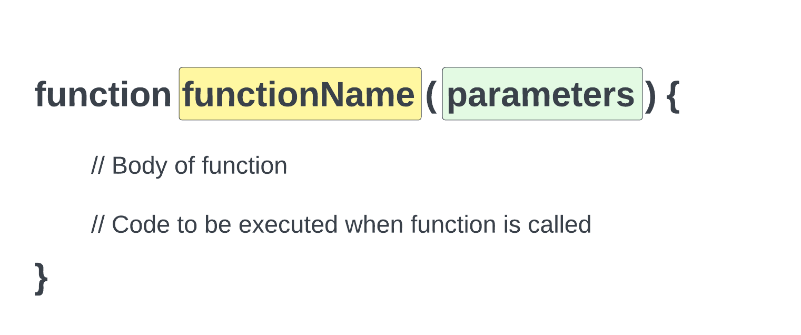

# Basic Functions

Welcome to your first lesson on functions. We have been using some built-in functions in PHP, but now we are going to learn how to create our own functions.

## What is a function?

A function is a block of code that performs a specific task. We can call a function multiple times throughout our code. This allows us to reuse code and keep our code organized.

## Creating a function

Here is the basic syntax for creating a function:


<br>

We create a function using the `function` keyword. We then give the function a name. The name should be descriptive of what the function does. We then add a set of parentheses and we can have possible parameters. We will learn more about these later. Finally, we add a set of curly braces. Inside of the curly braces, we add the code that we want to run when the function is called.

Here is an example:

```php
function sayHello() {
    echo 'Hello';
}
```

This function is called `sayHello()`. It does not take any arguments/parameters. It simply echoes out the string `Hello!`.

## Calling a function

Right now, we don't see any output. That is because all we have done is created the function, not we need to 'call' or 'invoke' it.

We call a function by using the function name followed by a set of parentheses. We can call a function as many times as we want.

Here is an example:

```php
sayHello(); // Hello
sayHello(); // Hello
sayHello(); // Hello
```

## Function names

Function names follow the same rules as variable names. They can only contain letters, numbers, and underscores. They cannot start with a number. They cannot contain spaces or special characters. They are case insensitive, so the function `sayHello()` is the same as `sayhello()`.

## Return values

So far, we have only created functions that echo out a string. This is really not that common unless it is some kind of utility function. Most functions will return a value. We can return a value using the `return` keyword.

Here is an example:

```php
function sayGoodbye() {
    return 'Goodbye';
}
```

Now if I run the function, I will not see any output. That is because the function is returning a value, not echoing it out. We can echo out the value by using the `echo` keyword.

```php
echo sayGoodbye(); // Goodbye
```

More importantly, we can store the value in a variable and use it later.

```php
$goodbye = sayGoodbye();
echo $goodbye; // Goodbye
```

In the next lesson, we will learn about parameters and arguments.
