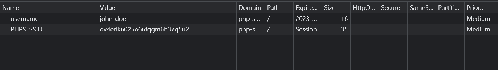

# Understanding $\_COOKIE in PHP: A Guide

Cookies play a significant role in web development and user experience. They allow you to store data on a user's device, making it accessible between different page visits or sessions. In PHP, you can work with cookies using the `$_COOKIE` superglobal. In this lesson, I will explain what `$_COOKIE` is, how to set and retrieve cookies, and some best practices for using them.

## What is $\_COOKIE?

`$_COOKIE` is a superglobal array in PHP that holds the values of cookies sent by the client's browser to the server. Cookies are small pieces of data stored on a user's device, typically containing information such as user preferences, session identifiers, or shopping cart contents. These cookies are sent with HTTP requests, allowing the server to remember information about the user.

## Cookies vs Sessions

Cookies and sessions are both mechanisms for storing data on a web server, but they have significant differences in how they work and when to use them. Here are some key differences between cookies and sessions:

1. **Storage Location**:

- **Cookies:** Cookies are stored on the client-side, typically in the user's browser. Each cookie has a limited storage capacity (usually around 4KB per cookie).
- **Sessions:** Session data is stored on the server-side. The server assigns a unique session identifier (usually stored in a cookie) to the client, and the associated data is stored on the server.

2. **Data Persistence**:

- **Cookies:** Cookies can be set with an expiration time, allowing data to persist on the client's device beyond the current session. Persistent cookies can have longer lifespans, while session cookies are deleted when the browser is closed.
- **Sessions:** Session data exists only for the duration of a user's visit to a website. When the user closes their browser or remains inactive for a specified period (session timeout), the session data is typically destroyed.

3. **Security**:

- **Cookies:** Cookies can be less secure because they are stored on the client-side and can be tampered with by the user. However, you can enhance security by using features like the HttpOnly and Secure flags.
- **Sessions:** Sessions are generally more secure because the session data is stored on the server-side and is not accessible or modifiable by the client. However, session hijacking can be a security concern if not properly protected.

4. **Storage Capacity**:

- **Cookies:** Cookies have limited storage capacity, making them suitable for small amounts of data, such as user preferences or tokens.
- **Sessions:** Sessions can store larger amounts of data since they are maintained on the server. However, storing excessive data in sessions can impact server resources.

5. **Ease of Use**:

- **Cookies:** Cookies are easy to work with and do not require server-side scripting. Data retrieval is straightforward on the client-side.
- **Sessions:** Sessions often require server-side scripting to create, manage, and destroy sessions. Working with sessions can be more complex, especially in larger applications.

6. **Cross-Tab Communication**:

- **Cookies:** Cookies can be accessed across different browser tabs or windows, allowing data sharing within the same domain.
- **Sessions:** Sessions are generally isolated to a single tab or window. Communication between different tabs or windows within the same session can be challenging.

7. **Use Cases**:

- **Cookies:** Cookies are often used for user authentication tokens, remembering user preferences, tracking user behavior, and implementing client-side features like shopping carts.
- **Sessions:** Sessions are commonly used for server-side authentication, storing temporary data during a user's visit (e.g., shopping cart contents), and managing user-specific data.

## Setting Cookies

You can set cookies in PHP using the `setcookie()` function. The basic syntax is as follows:

```php
setcookie(name, value, expire, path, domain, secure, httponly);
```

- `name`: The name of the cookie.
- `value`: The value to store in the cookie.
- `expire`: The expiration time of the cookie (optional).
- `path`: The path on the server for which the cookie is available (optional).
- `domain`: The domain for which the cookie is available (optional).
- `secure`: Indicates if the cookie should only be transmitted over a secure HTTPS connection. If true, the cookie will only be set if a secure connection exists.
- `httponly`: When true, the cookie will be made accessible only through the HTTP protocol. This means that the cookie won't be accessible by scripting languages like JavaScript, which can help mitigate attacks such as cross-site scripting (XSS)..

Open the `index.php` file in your browser and add the following code to set a cookie:

```php
<?php
  setcookie('username', 'jdoe', time() + 3600, '/');
?>
<!DOCTYPE html>
<html lang="en">

  <head>
    <title>Set Cookie</title>
  </head>

  <body>
    <p>Cookie set. <a href="page.php">Go to page.php</a></p>
  </body>

</html>
```

In this example, we set a cookie named `username` with the value `jdoe`, an expiration time of `one hour (`time() + 3600`)`, and the cookie is available on the entire website ("/").

It is important to know that the cookie will not be available until the next page load. This is because the `setcookie()` function sets the cookie in the HTTP response header, which is sent to the browser. The browser then stores the cookie and sends it back to the server on subsequent requests. You could however use JavaScript to get the cookie right away.

After you set the cookie, open up the browser dev tools and click on the "Application" tab. You should see the cookie under the "Cookies" section.



## Retrieving Cookies

To retrieve cookies, you can access the `$_COOKIE` superglobal, which is an associative array. For example:

```php
$_COOKIE["username"];
```

This code fetches the value of the "username" cookie and assigns it to the `$username` variable.

## Checking if a Cookie Exists

Before accessing a cookie, it's a good practice to check if it exists to avoid errors. You can use the `isset()` function for this purpose.

Open or create the `page.php` file and add the following code:

```php
<?php
$username = $_COOKIE['username'] ?? 'Guest';
?>

<!DOCTYPE html>
<html lang="en">

<head>
  <title>Set Cookie</title>
</head>

<body>
  <h1>Welcome <?= $username ?></h1>
  <a href="destroy.php">Delete cookie</a>
</body>

</html>
```

Here, we are checking if the "username" cookie exists. If it does, we set it to the `$username` variable. If not, we set it to 'Guest'.

## Deleting Cookies

You can delete a cookie by setting its expiration time to a past date. For example:

Open or create the `delete.php` file and add the following code:

```php
<?php
  // Delete cookie
  setcookie('username', '', time() - 3600, '/');
?>
<!DOCTYPE html>
<html lang="en">
  <head>
    <title>PHP Cookies</title>
  </head>
  <body>
    <p>
      Your cookie has been deleted. <a href="page.php">Go to page.php</a>
    </p>
  </body>
</html>
```

Now you should be able to set, retrieve, and delete cookies in PHP.

## Security Considerations

When working with cookies, consider these security best practices:

1. **Sensitive Data**: Avoid storing sensitive information in cookies as they are accessible on the client-side.

2. **Secure and HttpOnly Flags**: Use the `secure` and `httponly` flags appropriately to enhance security. The `secure` flag ensures the cookie is only transmitted over HTTPS, while the `httponly` flag prevents JavaScript access.

3. **Validation**: Validate and sanitize data stored in cookies to prevent security vulnerabilities.

4. **Expiry Time**: Set reasonable expiry times for cookies to ensure they don't persist longer than necessary.

5. **Encryption**: If needed, encrypt cookie values to protect sensitive data.

## Setting an HTTP-Only Cookie

An HTTP-Only cookie is a cookie that is inaccessible to JavaScript. This is useful for preventing cross-site scripting (XSS) attacks. To set an HTTP-Only cookie, you can use the `httponly` flag in the `setcookie()` function. For example:

```php
setcookie('username', $username, time() + 3600, '/', '', false, true);
```

The empty string is used for the domain parameter, and the `secure` flag is set to `false` since we are not using HTTPS.

If you look in your dev tools, you will see that HTTP-Only is set to true.
