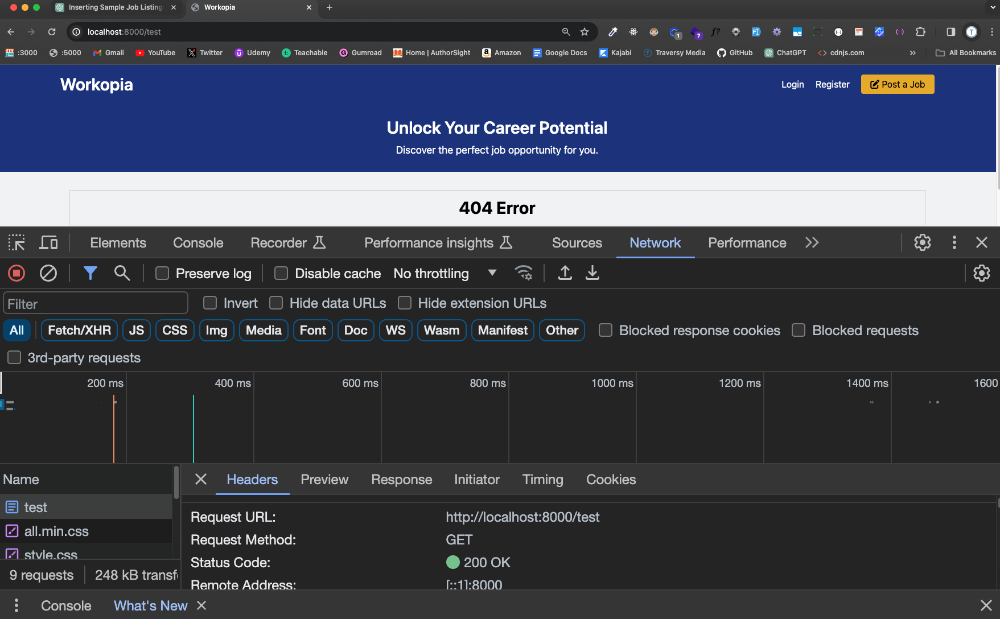
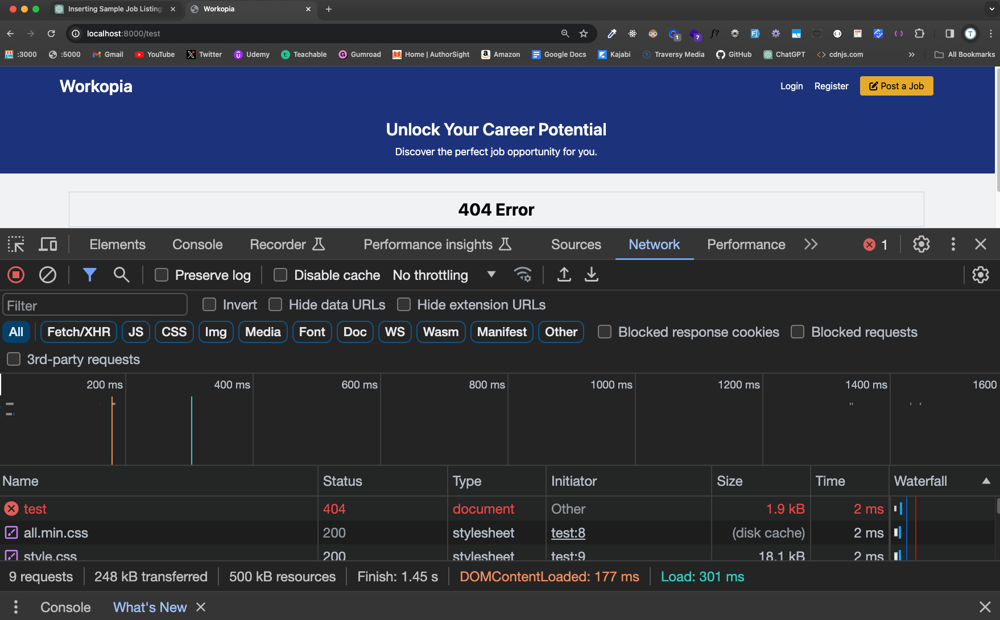

# Separate Routing Files

Now that we have a working router and 404 handling, let's clean up our code a bit and take the routing logic out of the `public/index.php` file.

We will have one file for our routes and one for the router. Ultimately, the router will be a class with methods. We will do that soon.

Create a file called `routes.php` in the root directory. This will be where we define our routes. Instead of putting the array in a variable, we will just return it.

```php
return [
  '/' => 'controllers/home.php',
  '/listings' => 'controllers/listings/index.php',
  '/listings/create' => 'controllers/listings/create.php',
  '404' => 'controllers/error/404.php'
];
```

Now, create a file called `router.php` in the root directory. This will be where we define our router. We will use the `routes.php` file to get the routes.

```php
$routes = require('routes.php');

if (array_key_exists($uri, $routes)) {
  require $routes[$uri];
} else {
  require $routes['404'];
}
```

Now your `public/index.php` file should look like this:

```php
require '../helpers.php';

$uri = $_SERVER['REQUEST_URI'];

require basePath('router.php');
```

## Send a 404 Status Code

Right now we are just sending the 404 page, but we are not sending the 404 status code. HTTP has specific codes for different types of responses. a `200` response means everything it ok and that is what we are sending now. If you go to a page that does not exist and you open your devtools and look at the `Network` tab, you will see `200 OK`:



We can send a 404 status code by using the `http_response_code()` function.

In your `router.php` file, add this line before the `require $routes['404'];` line:

```php
http_response_code(404);
```

Now when you go to a page that does not exist, you will see `404 Not Found` in the `Network` tab:



In the next lesson, we will add a bit more functionality to our router and then we'll get into the database stuff.
