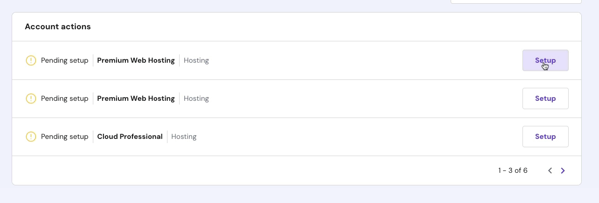
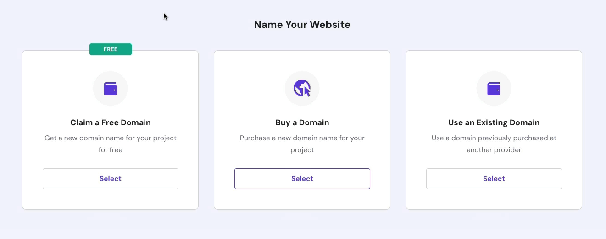
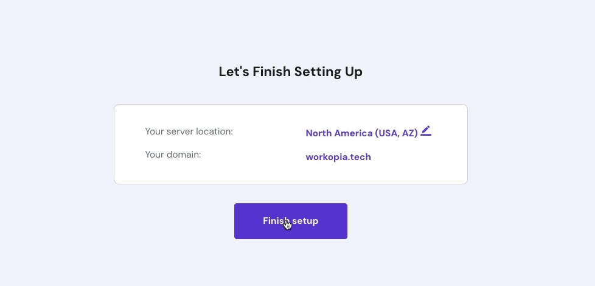

# Hosting & Domain Setup

Once you have a Hostinger account, you will see an option to setup hosting. Click the button to start the process.

You will get some questions about setting up your site. You can click the "Skip" button for these. We will do it manually.

## Domain

When it asks about a domain, you can click "Claim a Free Domain" or if you already have a domain click "Use Existing Domain".

Click on "Finish Setup".

It will take a few minutes to set everything up including your SSL.

Now you can go to the control panel and manage your site.

The domain will take about 25 minutes to propogate, but there is nothing else you have to do as far as your domain.

In the next lesson, we will export the local database into a `.sql` file so that we can import it into our production database.
