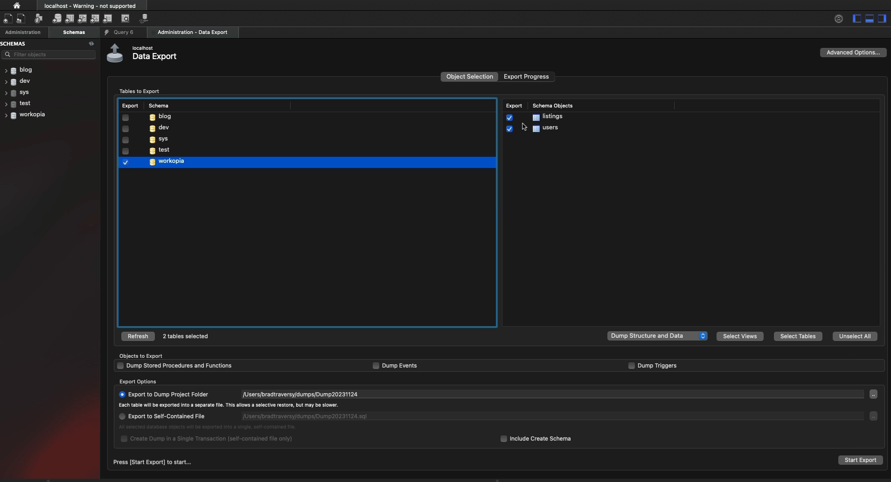

# Database Export

In this lesson, we will export our database so that we can import it into the production database. We will do this from MySQL Workbench. 

Open up Workbench and go to "Server->Data Export".

Select the "workopia" database.



Take note of where the file will be output.

Make sure that "Include Create Schema" is not selected.

Click on "Start Export" and go to the "dumps" output folder.

You should have 2 files

- `workopia_listings.sql`
- `workopia_users.sql`

There is a file for every table.

I want to combine these into a single file. Create a new empty file called `workopia.sql`.

Add the following at the top:

```sql
CREATE DATABASE IF NOT EXISTS workoopia;
USE workoopia;
```

Now copy the content from the `workopia_users.sql` file and paste it in your `workopia.sql` file.

Do the same with the `workopia_listings.sql` file.

You can test this out by pasting the entire query into a Workbench query tab. Just change the name of the database on the first 2 lines.

Now we are ready to import the database to production.