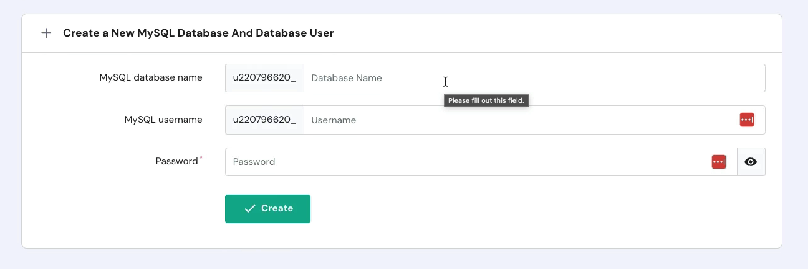
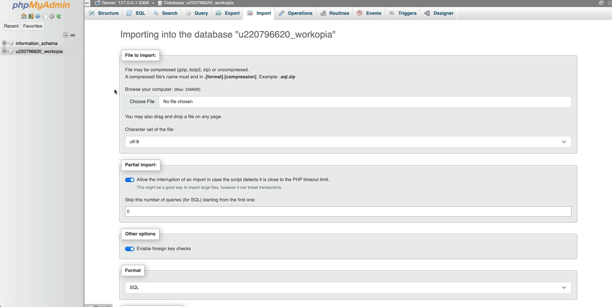
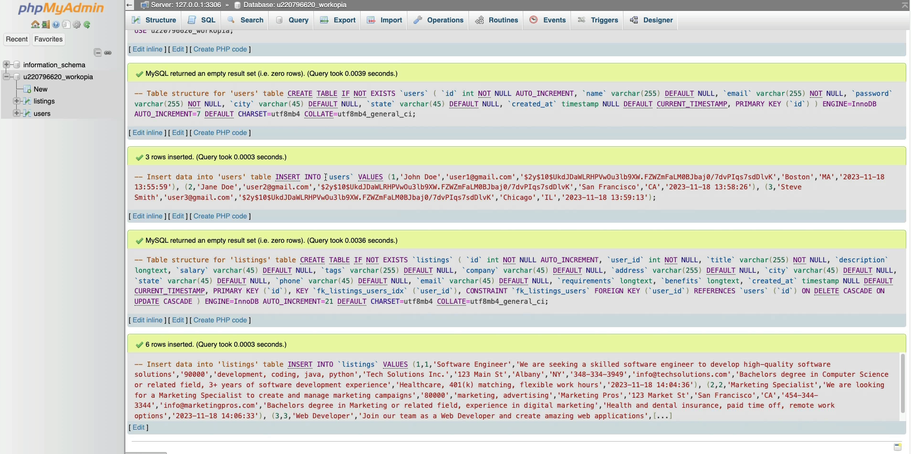

# Database Import

Now that we have out Hostinger account setup, we will setup a new production database and import the `workopia.sql` file.

Open your control panel and on the left, go to "Databases" and click "Management".

Create a new database. You can call it "workopia" but it will automatically have some characters behind it with an underscore. Take note of that.

Create a user as well, which will be prefixed with the same characters as the database.

Add a password for the user.

Now we have a brand new database.

Now, click on the "Enter PHPMyAdmin" button.

This is a web interface to manage your data.

From here, click on the "Import" tab.

Before you import the `workopia.sql` file, you need to open it and change the database name to your new database name with the prefixed characters.

Also, where you see the following:

`utf8mb4_0900_ai_ci`

Change it to

`utf8mb4_general_ci`

There should be 2 instances to change.

Save the file and we are ready to import.

In PHPMyAdmin, browse for the file and import it. You should see a bunch of green check marks.

Now your database is setup in production.
